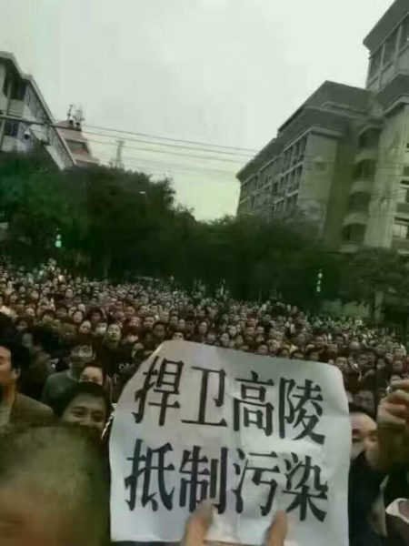
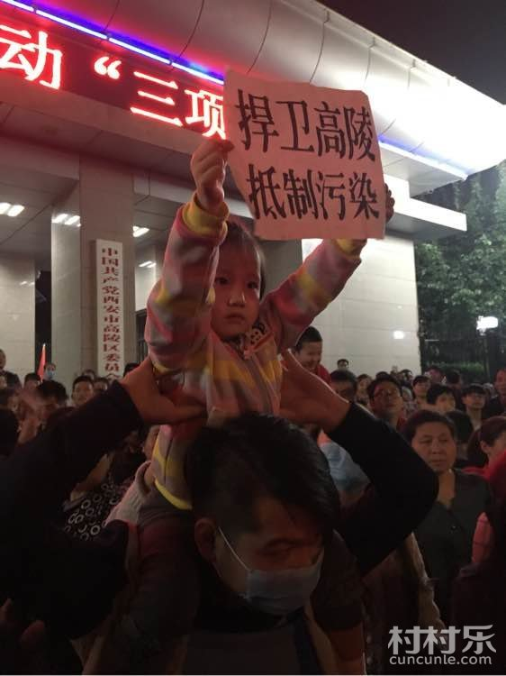

# 高陵垃圾焚烧厂事件

### 关键词

垃圾焚烧厂、抗议

### 摘要

陕西西安高陵区大批民众自10月11日起连续多日在区政府拉横幅游行示威，反对当局在当地兴建垃圾焚烧厂的计划（焚燒西安市生活垃圾）。西安市高陵區政府針對居民抗議反對，13日晚發佈《告廣大市民書》指，連日群眾聚集活動已造成道路交通堵塞，政府機關辦公受干擾，社會秩序受嚴重影響，警告個別人「造謠生事」封門堵路觸犯法律，同時又稱「群眾不同意不開工」。但截至15日，示威抗议仍在进行之际，中国国内媒体都没有报道，而当地民众将消息发到新浪微博后很快就被删除。

### 官方措施

高陵区政府发布《告广大市民书》，指垃圾焚烧厂项目已经过多重谘询，请市民"相信"区政府。又指民众集会抗议影响交通，干扰社会秩序，以及有人造谣传谣，可能已触犯法律。与此同时，当局调动大批警力进行镇压。在区政府门前曾一度发生肢体冲突，多名带头民众被便衣抓进政府大楼内。

据海外媒体报道，当地政府从西安市调动了大批防暴警察在高速路口处待命，晚上人少时很有可能进行抓人。同时全区的镇长、村长被要求把守各地路口，阻止民众游行。

### 媒体报道

国内报道无

2016年10月16日，自由亚洲电台报道“西安万人连日抗议建垃圾焚烧厂 政府指抗议或违法吁民众信任”，文章指出："这样的情况政府一般不报道，建垃圾站的地点是高陵县，沿着渭河的地方，将非常严重的污染渭河水，渭河又是黄河的主要支流，所以他对河流生态的污染和危害是非常严重的。"

同一天，海外媒体《大纪元》发文"西安万人上街抗议垃圾焚烧厂 警大肆抓人"，文章指出：在区政府前有一名官员声称“哪怕高陵人死完了，也要建焚烧厂”，引起现场民众愤怒。当地民众表示，他们将持续进行示威抗议，直至政府正式宣布取消该项目建设为止。高陵区地处关中腹地，人口稠密，村连村，地连地，素有“关中白菜心”之称，是粮食、蔬菜大县。欲开工的垃圾焚烧厂位于该区药惠村的原西京水泥厂，该地位于高陵城区上风口2.3公里，西安主城区上风口40公里处，周边数百米内有两所学校以及密集的居民社区，投资3亿元。

### 关键人物

无

### 网友评论

> 高陵政府这条街全程戒严，天上的无人机，地上穿警服的人墙！店面直接被强制拉的关门，站在自己店门口多说一句话的女娃直接被抓了，抓过去的在车背后直接被打！甚至用自己的皮靴直接踩百姓的头！谁录像直接被打！

...

> 为什么，因为他们也不是高陵的人民，因为他们暴力执法！所谓西安下来的警察一个个可恶的嘴脸与行为，像是我们犯了弥天大错，我们只是最底层最一无所有的老百姓为了维护自己的家园在合理合法游行！更何况你们的权利还是我们人民赋予的！

...

> 消息全部被封锁，媒体不让报道！被抓走了爸爸的小孩的哭喊“我要回家”，被抓走了儿子的老人坐在地上的坚守，被伤了心的老百姓的心声“没王法了，用枪直接扫涉完我们算了”！高陵城人心慌慌，悲悲戚戚！高陵在哭泣！

...

### 资料留存

### 后续追踪

...
