# 贾敬龙案件

### 关键词

强拆婚房、复仇杀人、死刑立即执行

### 摘要

贾敬龙是中国河北省石家庄市郊区农民。2013年5月27日（距离他27岁生日6天、拟举办婚礼18天），他的私人别墅被以村长为代表的村委会组织强行拆迁。由此引起他和村长之间矛盾的冲突。之后村长未能返还本应补偿拆迁的一套商品房和相应的补偿金，使矛盾激化。在状告无门的情况下，2015年2月19日，他用打工使用的装修工具-射钉枪射杀村长。

### 官方措施

2015年11月24日，河北省石家庄市中级人民法院判决被告人贾敬龙犯故意杀人罪，判处死刑；2016年4月6日上午，河北省高级人民法院在石家庄中院开庭第二次审理贾敬龙上诉案件，2016年5月17日，河北省高级人民法院作出二审裁定，驳回上诉，维持原判。最高法院于2016年8月31日作出了死刑核准裁定，即将交付执行。 这是中国最高人民法院收回死刑复核权后，少有的一起杀一人被核准执行死刑的案件。

### 媒体报道

案发第十天的3月28日，《北京青年报》才刊登了一篇署名“钟欣”的采访报道：《石家庄村支书被枪杀行凶者系同村村民》

### 关键人物

贾敬龙

### 网友评论

```
杀了贾敬龙，还有后来人！
```

```
反抗者贾敬龙：杀了他，再给他一刀
```

### 资料留存

强拆现场贾敬龙不肯离开：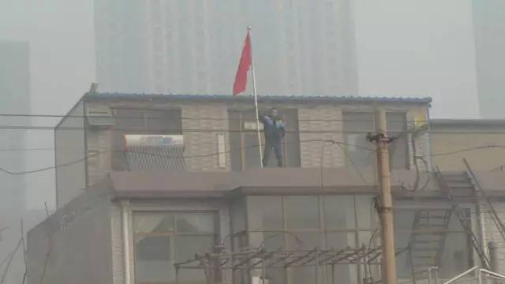
强拆现场：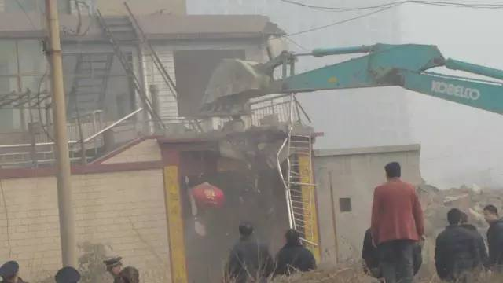
强拆现场：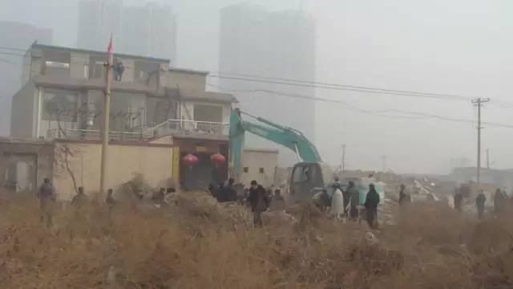
北高营村唯一留下来的十多亩耕地被围挡了起来：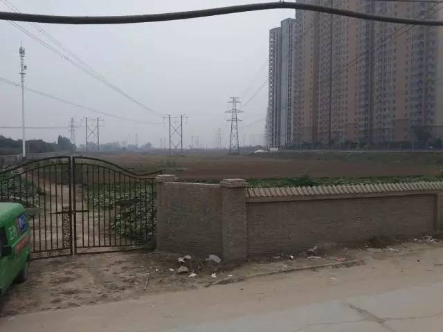
北高营村三千余亩地，如今大部分被开发或者围挡：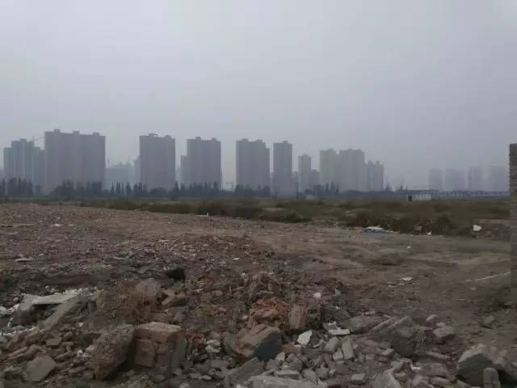
旧村改造中，对没有签字拆迁的住户使用“三停”政策：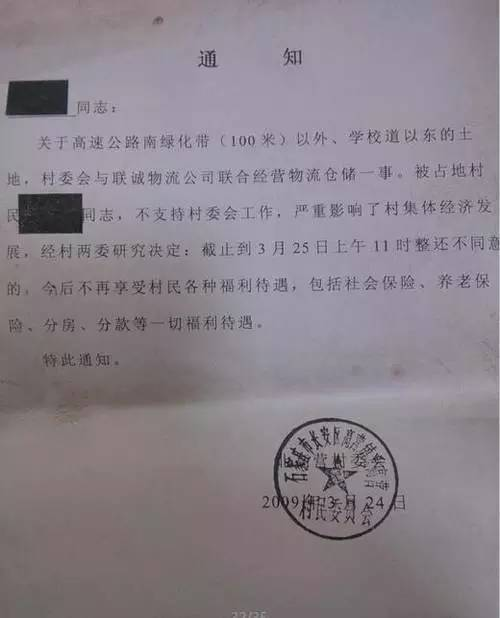
强制征地的通告：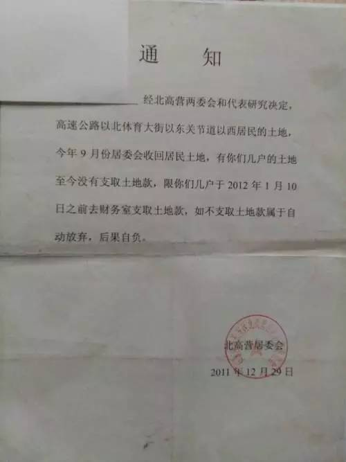
贾同庆在没有征得儿子、女儿的同意下与村委会签订了房屋拆迁协议：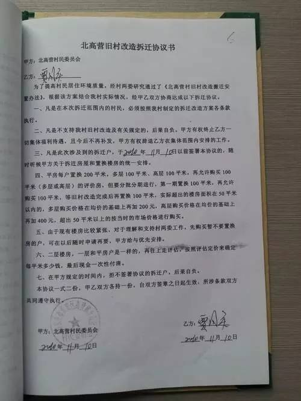
贾敬龙用硬币贴起来的装饰物：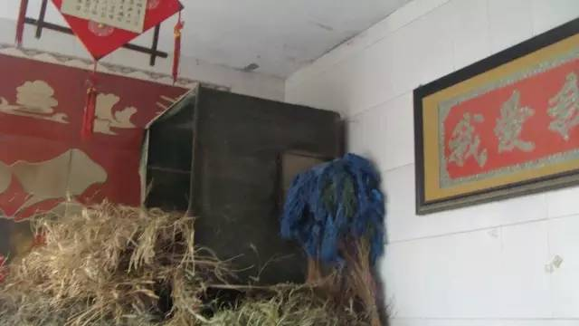
贾敬龙的旧宅上已经盖起了高层住宅：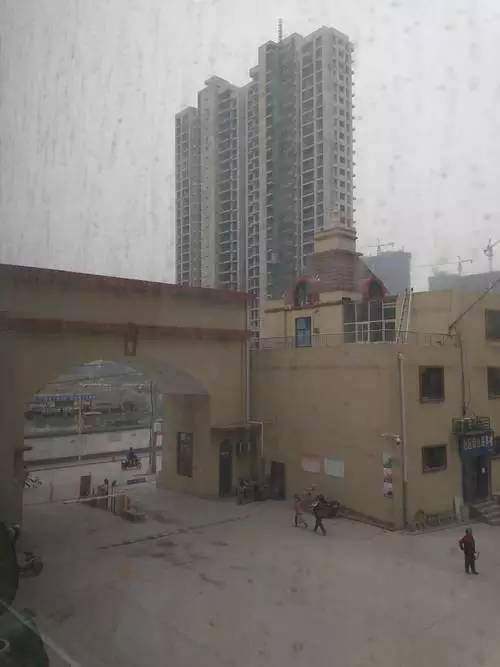
贾敬龙照片：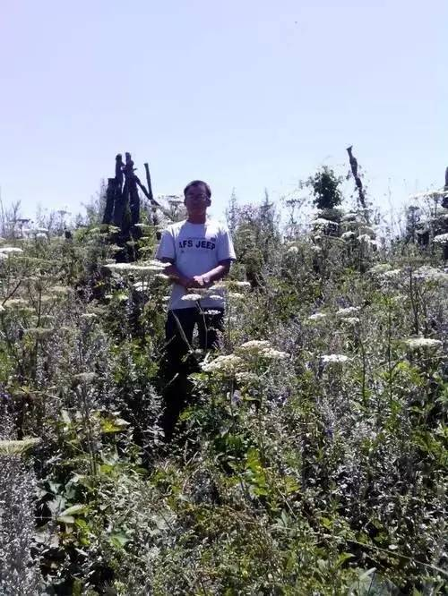
贾敬龙养的花草：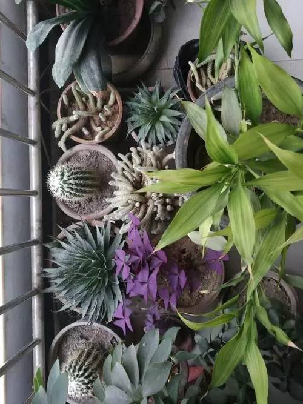
贾敬龙故意杀人案死刑停止执行的紧急申请：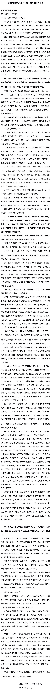

### 后续追踪

...
