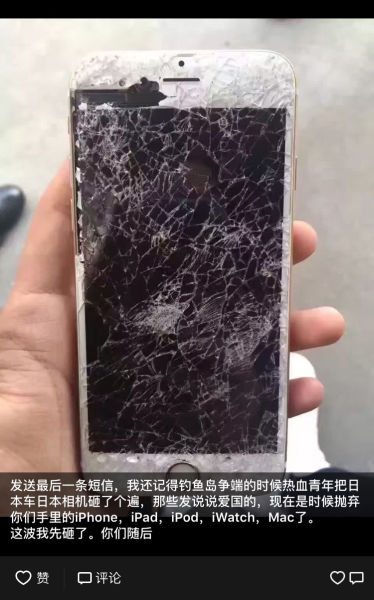
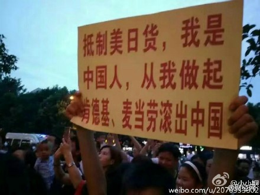
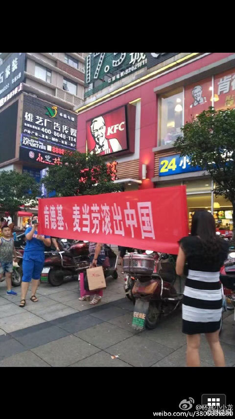

# 肯德基滚出中国

### 关键词

南海仲裁、爱国贼、抵制蠢货

### 摘要

2016年7月12日，南海仲裁案结果公布之前，美军派多艘航母和驱逐舰部署到南海，包括“里根”号航母在内的7艘美军舰船，其中3艘驱逐舰过去两周更是多次“悄悄接近”中国岛礁，向中方展示所谓的“决心”。南中国海仲裁结果出炉后，在中国大陆网上和民间掀起波澜。网民普遍认为是美国在南中国海派兵是对中国耀武扬威，强迫中国接受南海仲裁结果。民族主义情绪不断在社交网络、微信中积累，以至于7月17日，唐山乐亭“夏日购物”大楼，几名男女站在肯德基门口，拉起红色横幅。横幅上写着“你吃的是美国的肯德基，丢的是咱老祖宗的脸。”

### 官方措施

南通警方表示，就爱国情感表达而言，这些极端之举，非但不能提升爱国认知，反而助长了社会暴戾气氛。

淮安市公安局淮阴分局发布公告称，看到鼓动集会游行抵制肯德基的帖文，请广大市民不要轻信、盲从。表达爱国热情，值得肯定，但绝不可逾越法律底线，更不允许做出过激行为。

宿迁市泗阳县公安局也发布微博表示，“爱国，请别把愤怒发泄到自己的领土之上”，呼吁群众不要做出“亲者痛仇者快”的行为。

### 媒体报道

2016年7月19日，新华网，“折腾自己不是爱国”：身为中国人,心系国家前途命运,揭露“南海仲裁闹剧”背后的不公正,是爱国感情的体现。不过,如果这种情感释放,变为破坏社会正常秩序的不法行为,还将其贴上“爱国”的标签,就走入了误区。

2016年7月20日，财经网，“河北乐亭县肯德基遭围堵 青年质疑非理性爱国被打”：多地抵制肯德基 “爱国”还是炒作？警方表示爱国可以，但不允许做出过激行为，这样不能提升爱国认知，反而助长了社会暴戾气氛。

2016年07月20日，新浪法院频道，“不要让爱国成为流氓的庇护所，爱国从抵制蠢货开始！”：一言以蔽之，理性爱国当是现代民主、文明、法制社会中健康、主流之意见，那些动辄就“抵制XX”、“诅咒XX”的爱国行为，犹如三岁幼童一般，幼稚到令人可笑，更无知到令人骇然，必须予以彻底清除、摒弃。

### 关键人物

...

### 网友评论

```
“抵制美日韩菲，爱我中华民族，你吃的是美国肯德基，丢的是老祖宗的脸。”
```
```
“肯德基、麦当劳滚出中国”
```
```
“要砸烂苹果手机”
```

### 资料留存








### 后续追踪

...
