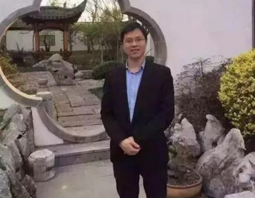
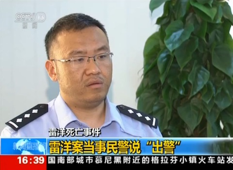
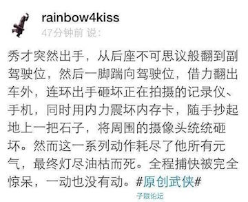
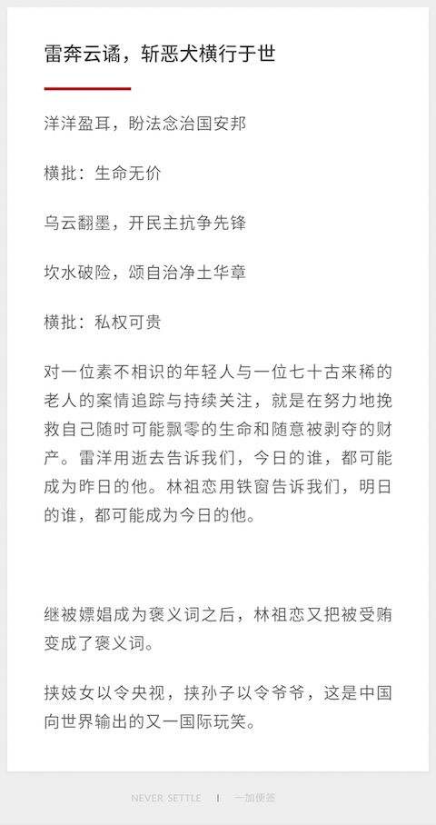
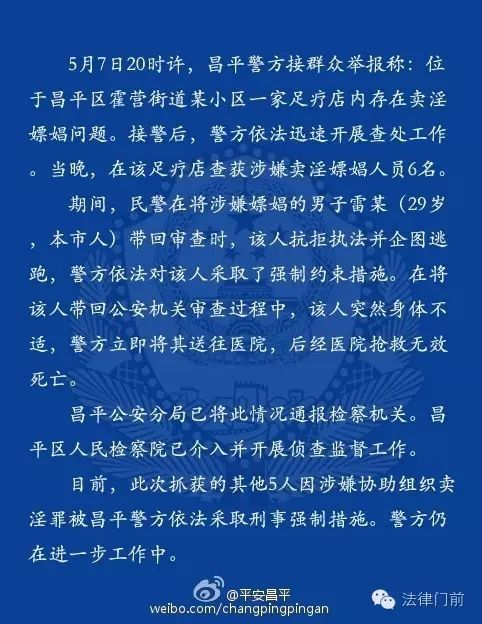
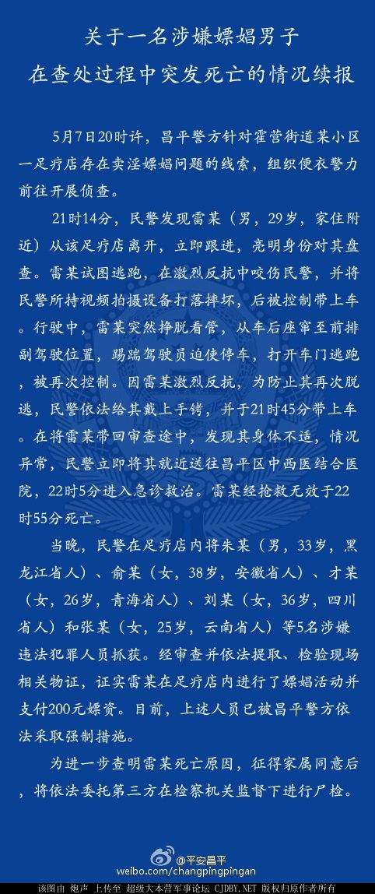
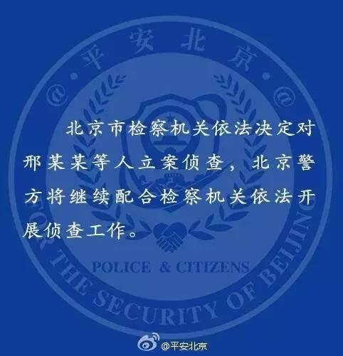

# 雷洋事件

### 关键词

带套打飞机

### 摘要(摘自百度百科)

雷洋 （中国人民大学环境学院2009级硕士研究生），2016年5月7日，由于雷洋夫妇刚得一女，其亲属欲来京探望，航班预计当晚23点30分到达。
当晚21时左右，雷洋从家里出门去首都机场迎接亲属，之后雷洋失联。

2016年5月8日凌晨1时，家人接昌平东小口派出所消息，要求亲属赶赴派出所。他们于1时30分左右赶到后，被告知雷某因涉嫌嫖娼，在被警车带往派出所的途中因心脏病突发死亡。雷某被送到医院的时间为5月7日晚22点09分，到达时已经死亡。

2016年5月8日凌晨4点30分，亲属见到了雷某的尸体，发现其手臂和头部都有明显淤血。警察表示，途中雷某曾强烈反抗，跳车时头部着地，因此受伤。

### 官方举措

2016年5月9日晚间，昌平警方通报此事称，5月7日20时许，昌平警方接群众举报，位于昌平区霍营街道某小区一家足疗店内存在卖淫嫖娼问题，接警后，警方依法迅速开展查处工作。当晚在该足疗店查获涉嫌卖淫嫖娼人员6名。期间，民警在将涉嫌嫖娼的男子雷某（29岁，本市人）带回审查时，该人抗拒执法并企图逃跑，警方依法对该人采取强制约束措施。在将该人带回公安机关审查过程中，该人突然身体不适，警方立即将其送往医院，后经医院抢救无效死亡。

2016年5月11日凌晨，北京昌平警方通过官方微博再次通报雷洋死亡事件，标题为：“关于一名涉嫌嫖娼男子在查处过程中突发死亡的情况续报”，描述了事情的整个过程，其中提到视频拍摄设备被摔坏，有物证（避孕套、200元嫖资）证实雷洋嫖娼；并在北京电视台接受采访，称避孕套证实其嫖娼，而且通过避孕套提取精液DNA，从卖淫女的供述指认以及场所其他人员的供述指认，都能够认定雷某的嫖娼行为；

2016年5月19日，北京市人民检察院表示，鉴于昌平区人民检察院先已接收雷某家属控告并已依法开展初查工作，北京市人民检察院正依法进行督办，北京市人民检察院审查后，已依法将吴某某的报案材料移送昌平区人民检察院依法审查处理。随后，北京市公安局通过官方微博表示，对雷洋案高度重视。公安机关坚决尊重事实、尊重法律，坚决依纪依法处理，决不护短。

2016年6月1日，北京市人民检察院第四分院依法决定对昌平区公安分局东小口派出所民警邢某某等五人进行立案侦查，按程序通知家属。同日，北京市有关检察机关控告申诉检察部门还向雷洋家属吴某某通报了检察机关办理案件情况。

2016年6月30日，北京市人民检察院第四分院向雷洋死亡案件涉案警务人员及其家属、雷洋家属及双方聘请的律师依法告知了雷洋尸检鉴定意见。检察机关对北京明正司法鉴定中心作出的鉴定意见进行了审查，组织了专家审查论证、文证审查，确定死者雷洋符合胃内容物吸入呼吸道致窒息死亡。

涉案警务人员在执法中存在不当行为，昌平公安分局东小口派出所副所长邢某某、辅警周某起主要作用，且在案发后有妨碍侦查的行为。根据其行为性质和办案实际需要，北京市人民检察院第四分院已报请北京市人民检察院批准变更强制措施，对邢某某、周某以涉嫌玩忽职守罪依法决定逮捕。

### 媒体报道

澎湃新闻于9日晚21时55分以《家属称北京一男子失联死亡，警方：涉嫖娼带走时身体不适不治》为题，成为首家报道“雷洋事件”的新闻媒体。
澎湃披露：雷某妻子证实了网络热传的网贴的真实性。

财新网站发表题为《青年学者“涉嫖”被抓途中死 检察院已介入调查》文章，报道中披露，死者手机里的位置信息和通话记录被删除。

10日上午，光明网发表评论文章，“人大硕士死亡”需要逻辑链完整的答案。

财新发表评论，关注几起公共命案背后的兑换的关注度不平等现象。精彩语句：“屏幕背后的眼睛们一边读着新闻，一边……测算自己和不幸的潜在距离。”

10日下午，《人民日报》通过两微一端发布评论员文章，认为雷洋事件“只有事实真相才是定海神针”。

2016年5月11日，北京雷洋案足疗女接受北京电视台采访时说：“帮他打飞机”；

同时，CCTV-13新闻频道，播出了参与出警的昌平公安分局东小口派出所副所长邢永瑞的采访内容，首先提到的是“跨辖区执法”，警方称这是扫黄常用战法，当天晚上负责此次出警的现场指挥员邢永瑞带领一名民警和四名协警，身着便衣来到事发足疗店附近，发现足疗店出来一名男子出来后进行盘问，男子认为他们是假警察，喊救命，并发生肢体冲突，警方最终控制对方男子；整个过程没有携带执法记录仪进行录像，而是使用手机录像，原因是便衣打击，执法仪拿在手里非常显眼；记者提出要看一下手机录像视频，警方表示适当时候会公布。。。

### 关键人物

雷洋生前照片: 

昌平东小口派出所副所长邢永瑞: 

### 网友评论

微博网友：

雷奔云谲(jue)：

### 资料留存

20160509昌平警方微博通报一：

20160511昌平警方微博通报二：

20160601北京警方通报：

### 后续追踪

暂无下文...
