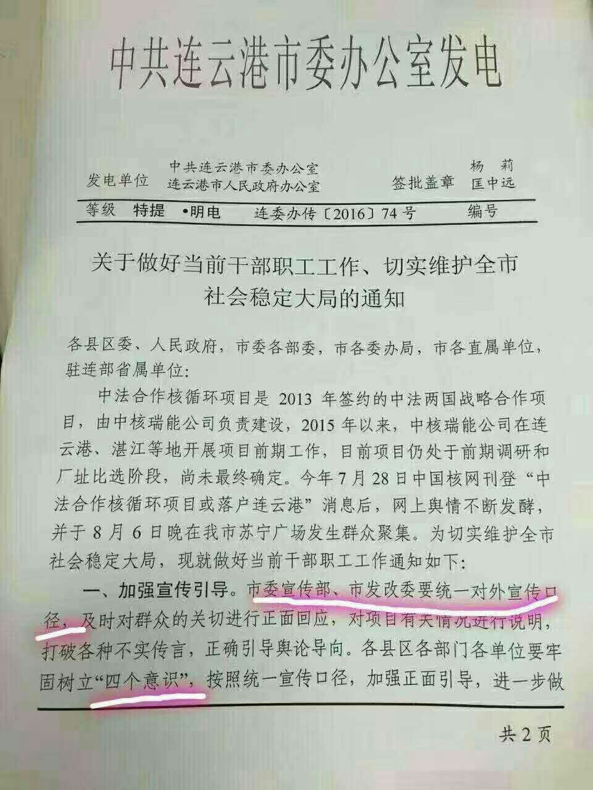

# 连云港核废料事件

### 关键词

核废料处理

### 摘要

2016年8月6日晚，大量连云港市民走上街头，反对总投资超千亿的核循环项目落户连云港。8月7日下午6点，连云港市政府称，
目前该项目正处于前期调研和厂址比选阶段，尚未最终确定会否落户连云港。

### 官方措施

。。。

### 媒体报道

2016年7月31日，搜狐公众平台（由入驻搜狐公众平台的作者撰写），“耗资超1000亿的核废料后处理大厂或落户连云港”：最近网上盛传，有一个总投资超1000亿的单个项目，有可能落户连云港。这是一个中法合作的项目，名称叫作“中法核燃料循环项目”。

2016年08月08日，人民网：“连云港：警察拖行殴打群众并致一名群众死亡系谣言”，人民网北京8月8日电 江苏省连云港市人民政府官方微博今日发帖辟谣，8月7日晚，在微信朋友圈等网络上有传播关于警察拖行殴打群众并致一名群众死亡的消息，经警方调查确认，该消息是谣言。警方提醒广大市民不信谣不传谣！

2016年8月7日，VOA，“连云港市民抗议兴建核废料处理厂”: 香港 — 据网上大量图片和视频显示，江苏连云港数以千计的市民星期六傍晚起在市中心聚集，抗议当地兴建核废料处理厂，要求当局撤回计划。警方派出大批警力到场，并在网上发出严厉警告，指集会未经批准，参与者可能违法。据报道，示威期间没有发生冲突，民众最终和平散去。

### 关键人物

。。。

### 网友评论

### 资料留存

连云港市委发电第一页：

连云港市委发电第二页：

国内核电站分布图：

六个严禁：

真实的谎言：

### 后续追踪

...
