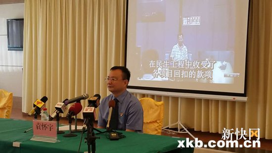
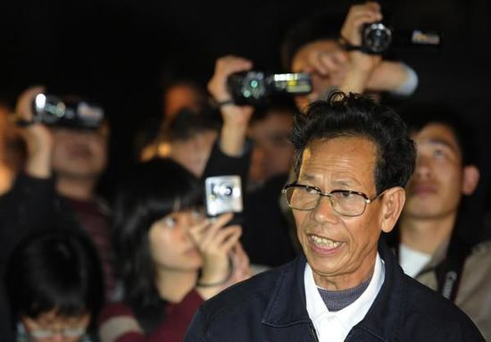
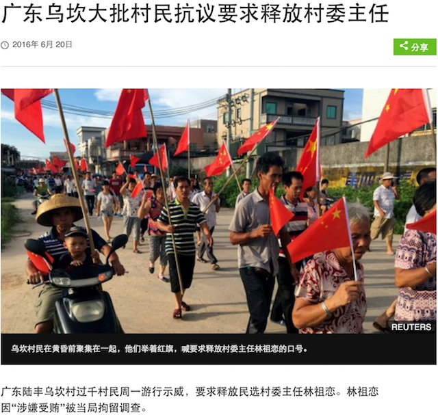
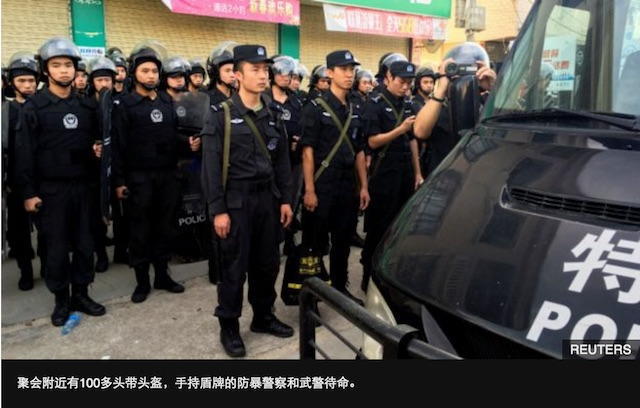
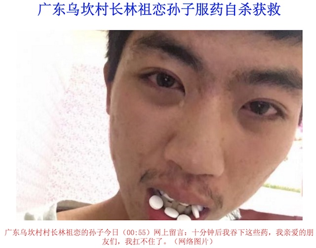

# 乌坎林祖恋事件

### 关键词

乌坎模式、电视认罪、孙子、毒跑道

### 摘要

林祖恋，男，曾用名“林祖銮”，广东陆丰人，中共党员。2012年3月，当选广东省陆丰市东海镇乌坎村委主任。2016年6月18日5时12分许，广东省陆丰市公安局发布消息称，乌坎村党总支书记兼村民委员会主任林祖恋因涉嫌利用职权受贿，已于6月17日被陆丰市人民检察院立案侦查并采取强制措施。

6月21日，广东汕尾市政府举行新闻发布会通报，东海镇乌坎村原党总支部书记、村委会主任林祖恋供认了自己收受贿赂的事实。7月21日，经汕尾市人民检察院审查，依法对陆丰市人民检察院立案侦查的东海镇乌坎村原党总支书记、村委会主任林祖恋，以涉嫌受贿罪决定逮捕。

### 官方措施

2016年6月21日，汕尾市人民检察院检察长袁怀宇在发布会上作出通报，并播放了林祖恋供认收受贿赂的视频：


### 媒体报道

2016年07月22日，新浪法院频道，“广东乌坎原村委会主任林祖恋涉嫌受贿罪被逮捕”：7月21日，经汕尾市人民检察院审查，依法对陆丰市人民检察院立案侦查的东海镇乌坎村原党总支书记、村委会主任林祖恋，以涉嫌受贿罪决定逮捕。案件正在进一步侦查中。

广东汕尾市政府21日公布乌坎原村委会主任林祖恋承认自己受贿的视频后，网民纷纷质疑，当局为何没有公布受贿证据和金额。

于是，官方第二天就通报了一条比较具体的罪状：林祖恋插手乌坎学校塑胶跑道工程，并从中收受高比例回扣，证实了一名自称为乌坎村村官的网民前天在当地网上论坛的举报。据后者透露，乌坎学校曾以50万元(人民币，下同，10万2300新元)招标铺设塑料跑道，一家企业以42万元中标，林祖恋从中获得8万元回扣。

### 关键人物

林祖恋：

### 网友评论

```
听说抓了人家孙子逼人家认罪，然后今天(0805)凌晨孙子自杀了……
```
```
逮捕之前林老没有犯罪，原来是逮捕之后查出来的，程序不对呀？
```
```
受贿八万元就被揪了出来，你这个村长也太不幸运了，八万元的贿款就红遍全国，值！
```

### 资料留存

村民游行支持：

村民游行警察严阵以待：

林祖恋孙子自杀：

### 后续追踪

据新华社广州9月8日电 经广东省高级人民法院指定管辖，佛山市禅城区人民法院9月8日一审公开开庭审理了广东乌坎村原党总支部书记林祖恋受贿案，并当庭公开宣判。
禅城区人民法院认为，公诉机关指控被告人林祖恋犯受贿罪和非国家工作人员受贿罪事实清楚，证据确实充分，足以认定；指控被告人林祖恋犯串通投标罪事实不清，证据不足。以受贿罪判处被告人林祖恋有期徒刑三年，并处罚金人民币20万元；以非国家工作人员受贿罪判处被告人林祖恋有期徒刑十个月，决定执行有期徒刑三年一个月，并处罚金人民币20万元。宣判后，林祖恋表示尊重法院判决，不上诉。

...
