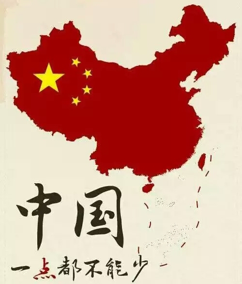
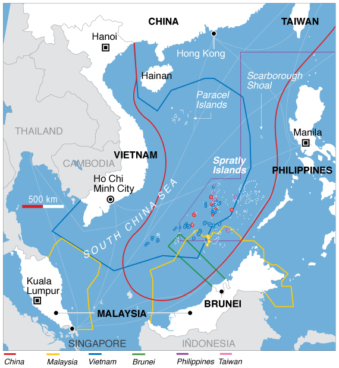
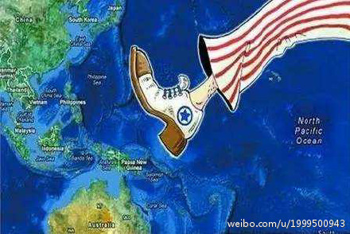

# 南海仲裁事件

### 关键词

菲律宾、南海仲裁案、四不立场、一点不能少

### 摘要

2013年1月22日菲律宾共和国以中华人民共和国在南中国海（菲律宾称西菲律宾海）中菲争议海域基于“九段线”的海洋权益主张及近年的海洋执法和岛礁开发活动已违反《联合国海洋法公约》（UNCLOS）为由向国际海洋法法庭提出对中华人民共和国提起的仲裁案。2013年2月19日，中国正式拒绝参与仲裁案。

2016年7月12日，仲裁庭公布仲裁结果，支持菲律宾在此案相关问题上的几乎全部诉求。仲裁庭5名仲裁员一致裁定，在《联合国海洋法公约》下中国对南海自然资源不享有基于“九段线”的“历史性权利”。仲裁庭还裁定中国在南海的填海造陆给环境造成了不可挽回的损失，并要求中国政府停止在南海的活动。

对此，中方多次声明，菲律宾共和国阿基诺三世政府单方面提起仲裁违背国际法，仲裁庭没有管辖权，中国不接受，不承认。

### 官方措施

2016年7月13日，中国国务院新闻办公室发表《中国坚持通过谈判解决中国与菲律宾在南海的有关争议》白皮书。白皮书系统阐述了中国政府在中菲南海争议和南海问题上的一贯立场和政策，彰显了中国维护国际法治及公平正义，维护南海和平稳定的决心。

白皮书强调，中国一贯遵守《联合国宪章》的宗旨和原则，坚定维护和促进国际法治，尊重和践行国际法，在坚定维护中国在南海的领土主权和海洋权益的同时，坚持通过谈判协商解决争议，坚持通过规则机制管控分歧，坚持通过互利合作实现共赢，致力于把南海建设成和平之海、友谊之海和合作之海。

2016年7月25日在万象举行的中日外长会谈中，中国外长王毅表示，南海仲裁案非法无效，中方不接受裁决。

### 媒体报道

2016年7月11日，中国网新闻中心：“党报谈南海仲裁：不合法的裁决不过废纸一张”，菲律宾南海仲裁案如此公然违背国际法，为何向来以“国际法官”自居的美国却在装糊涂？美国著名律师布鲁斯·费恩直言，美国的南海政策体现了其“危险的帝国思维”。

2016年7月12日，凤凰资讯：“媒体：看菲律宾15条“诉求” 才知道他们有多贪得无厌”。只有知道菲方（及其背后的西方律师团队）多么贪得无厌，才能理解中国坚持维护主权的正当性。原标题：菲律宾到底要什么？（来源：观察者网）

2016年7月12日，新华网：菲律宾南海仲裁案仲裁庭１２日作出非法无效的所谓最终裁决。对此，中方多次声明，菲律宾共和国阿基诺三世政府单方面提起仲裁违背国际法，仲裁庭没有管辖权，中国不接受，不承认。

2016年8月1日，紫荆网：“朱成虎将军：南海不会开战 中美博弈继续”，记者：这次南海仲裁案所谓的仲裁“结果”已经使得美日军舰开始更频繁地进入南海实施挑衅。按照目前局势判断，南海开战的可能性有多大？朱成虎：当前情势下，南海开战的可能性不大。。。而且和中国打一仗，美国的胜算几乎没有。再说发动一场相当规模的战争，对美国来说也绝非一个最佳选择。其后果可能就是把自己的发展机会拱手让给另一个大国。（朱成虎：解放军少将、国防大学教授）

2016年8月3日，人民网：“南海仲裁账目应向世界公开”，备受质疑的南海仲裁案临时仲裁庭又摊上事儿了。这回不是中国对仲裁及其裁决提出抗议，而是有菲律宾人怀疑巨额仲裁费存在问题。菲律宾前总统阿罗约的新闻发言人和办公厅主任戈韦托·蒂格劳不久前撰文称，菲律宾仅用于支付南海仲裁案的律师费就高达3000万美元。

### 关键人物

无

### 网友评论

```
7月12日南海仲裁案如若引发战争，不管你在那里路遇军列、军车、部队运输车、导弹车、军机，战舰、航母、补给舰，
勿拍照、录小视频发到互联网，你的无意动作就泄漏了军事机密，严重者也许你会被送上军事法庭，法律可不管你是有意无意，
爱祖国请为国保密。请传递
```

```
不买菲律宾芒果和香蕉。
```

```
南海仲裁案中国！不接受！不参与！不承认！中国一点都不能少！我是中国人。我同意！
```

### 资料留存




南海各国边界：



### 后续追踪

...
