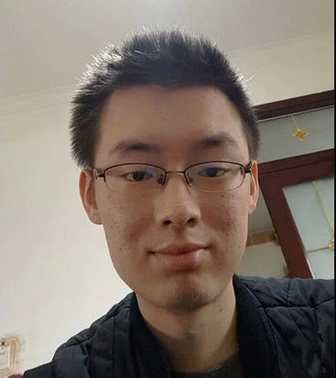
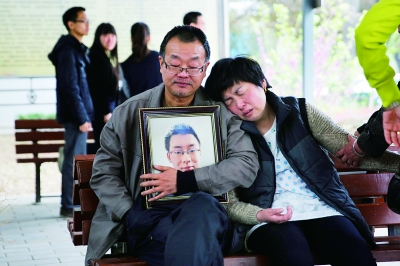
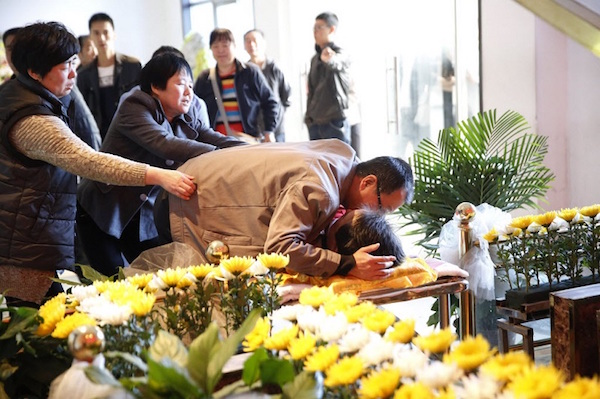

# 大学生魏则西之死

### 关键词

莆田系医院、百度推广、虚假宣传

### 摘要(百度百科)

魏则西，西安电子科技大学2012级学生，2014年4月，魏则西被查出得了滑膜肉瘤。这是一种恶性软组织肿瘤，目前没有有效的治疗手段，生存率极低，遂休学。魏则西是家中独子，父母倾尽全力为他治病，自2014年5月20日开始，辗转北上广各大肿瘤医院治疗，手术、放疗、化疗。

在北京的一家肿瘤专科医院里治疗期间，他听了一位医师的推荐，在通过百度搜索和央视得知“武警北京总队第二医院”后，魏则西父母前往考察，并被该医院李姓医生告知可治疗，于是从2014年9月至2015年底，魏则西先后在武警二院进行了4次生物免疫疗法的治疗，花了二十多万元，不见效果。2016年4月12日上午8时17分，魏则西在咸阳的家中去世，终年22岁。

### 官方措施

2016年05月03日，新京报：“联合调查组进驻百度查“魏则西事件””，国家互联网信息办公室发言人姜军发表谈话指出，近日“魏则西事件”受到网民广泛关注。根据网民举报，国家网信办会同国家工商总局、国家卫生计生委成立联合调查组进驻百度公司，对此事件及互联网企业依法经营事项进行调查并依法处理。同时，国家卫生计生委、中央军委后勤保障部卫生局、武警部队后勤部卫生局，于5月3日进驻武警北京市总队第二医院，对“魏则西事件”涉及的医院问题进行调查。

2016-05-10，魏则西事件调查处理结果：9日傍晚，国家网信办会同国家工商总局、国家卫生计生委成立的联合调查组公布调查结果，调查组认为百度搜索相关关键词竞价排名结果客观上对魏则西选择就医产生了影响,竞价排名机制影响了搜索结果的公正性和客观性，必须整改。

一是立即全面清理整顿医疗类等事关人民群众生命健康安全的商业推广服务；二是改变竞价排名机制，不能仅以给钱多少作为排位标准；三、建立完善先行赔付等网民权益保障机制。

调查认为，武警二院存在科室违规合作、发布虚假信息和医疗广告误导患者和公众、聘用的李志亮等人行为恶劣等问题。调查组责成武警二院及其主管部门采取四项措施立即整改。

据中国军网报道 中国军网记者通过武警北京市总队有关负责人了解到，武警北京市总队坚决落实4条整改要求，在武警部队工作组指导下，对武警北京市总队第二医院（以下简称武警二院）相关问题和有关责任人，从严作出如下处理决定：

立即终止与上海柯莱逊生物技术有限公司的合作，对武警二院其他合作项目运行情况进行集中清理整顿。

勒令涉及武警二院的合作方，停止擅自发布虚假信息、各类广告和不实报道。

对10名负有责任的相关人员依纪依法作出严肃处理。

其中，给予武警二院2名主要领导行政撤职处分，给予医院其他6名人员行政记过和行政记大过处分，对上级负有监管责任的2名领导分别给予行政警告和行政严重警告处分。

此外，对地方2名涉嫌违法犯罪人员，另有2人移交司法机关处理。


### 媒体报道

2016年5月2日，搜狐教育：“细思恐极，这三件事才是最终害死了魏则西的真凶”，　　1、缺乏医药渠道监管的的网络信息；2、医疗公司过度的治疗宣传；3、尚在临床的免疫疗法；

2016年05月03日，新华网：“聚焦魏则西事件：志愿者曾递申请 盼终止网络假广告”，。。。生前记录 从百度查到武警二院疗法排首位，魏则西的父母马上和武警二院联系，见到了一个姓李的主任。“他的原话是这么说的：这个技术是斯坦福研发出来的，有效率达到百分之八九十。”魏则西写道，李主任还对他的父母说“保我二十年没问题”。为此，家人还专门查了一下这个李主任，发现他上过中央台做节目，而且不止一次。“当时想着，百度、三甲医院、中央台、斯坦福的技术，这些应该没有问题了吧。” 后来，魏则西在知乎上认识了一个在美国的留学生，对方联系了多家美国医院后告诉他，生物免疫疗法在国外因为有效率太低，在临床阶段就被淘汰了，现在美国没有医院使用这项技术。“可到了国内，却成了最新技术，然后各种欺骗。”魏则西在网上记录说。

2016年5月10日，搜狐科技：“魏则西事件后，百度改也是死，不改也是死？”，5月9日晚间，“魏则西事件”终于有了一个初步结果。由国家网络信息管理办公室、国家工商总局、国家卫生计生委联合成立的调查组，正式公布了调查结果，对百度提出三大类、多项整改要求。百度随即回应，提出从六个方面全面落实。李彦宏还发了内部信，提醒百度人“勿忘初心，不负梦想”。

### 关键人物

魏则西：

### 网友评论

```
百度！你欠魏则西父母一个道歉！
```

```
魏则西百度推广事件谁以后再敢说有问题找度娘 我特么就是你干爹。
```

...

### 资料留存

悲痛欲绝的魏则西父母：


### 后续追踪

2016年06月15日，联合早报网，“魏则西父母：百度和武警二院从未道歉赔偿”，魏则西事件在5月发酵，但内地官方发布调查结果、百度CEO李彦宏发内部信后，事件已经渐渐平息。魏则西的父母近日接受内地媒体访问时表示，医院和百度方面从未道歉赔偿，他们也从未收到任何捐款。

内地官方对于该事件的调查结果相继公布后，魏则西的父母以为医院和百度会打个电话道歉，“一句道歉总该有吧？”但至今，魏则西父母说，“没有，什么都没有” ，“没有任何相关方与我们联系过”。




...
