# 邢台泄洪事件

### 关键词

洪灾、水库泄洪、官员下跪

### 摘要

2016年7月20日凌晨两点左右，河北邢台在暴雨之后，朱庄水库由于水位大幅度上涨达到极限而泄洪，结果发生悲惨事件。
邢台七里河下游的东汪村和大贤村，由于村民没有接到相关通知或者是接到通知时已经太晚，结果多人被洪水冲走，包括数名儿童，造成两个村庄多人死亡。

### 官方措施

7月23日晚10时许，邢台市委市政府在邢台万峰大酒店召开发布会，邢台市委副书记、市长董晓宇承认灾情统计、核实、上报不及时、不准确，并现场向七里河洪水所有遇难者表示沉痛哀悼，向遇难、失踪者亲属和受灾群众，向全社会诚恳道歉。

### 媒体报道

2016年7月23日，北京青年报：“邢台，被洪水淹没的真相”，7月20日凌晨2点左右，邢台高新区大贤村洪水突至，村民们猝不及防。突如其来的洪水没有给村民太多逃离的时间，多位村民被洪水冲走，其中包括几名儿童。截至23日上午7时，邢台市发布的相关数据中，大贤村共死亡8人，失踪1人。洪水爆发后的第16个小时。大贤村所在的邢台市经济开发区党工委书记王清飞在接受媒体采访时称“没有人员伤亡”。这样简单一句话似乎惹了众怒。

2016年7月24日，中国青年网：“七问邢台洪灾：是否人为泄洪 为何伤亡出入大”，1 洪灾发生前是否发布预警？2 洪灾发生是否因人为泄洪？3 死亡人数为何前后差别大？4 七里河洪水缘何决口漫堤？5 之前是否发现过河道变窄？6 洪灾后救援人员何时赶到？7 是否有应急预案并演练过？（注：中国青年网由共青团中央举办）

2016年7月25日，搜狐新闻：“媒体：邢台洪灾谁堵住了泄洪通道？”，早在洪水发生的半个月前，一个名叫“五方元音”的网友就在自己的新浪博客里，发出了预警：《邢台“七里河”，你做好了防汛、排涝的准备了吗？》文章作者说，因为看到南方暴雨成灾，他“思虑万千”，首先想到了七里河工程，于是骑着电动车赶往七里河下游的东汪、孔桥一带查看。但他却看到了这番景象：“宽达数百米的河道在这里被截留，两道土河坝堵住了河水的去处，虽然下面有管道的泄流，但是可以抵挡每天‘南水北调’的调控放水与近日邢台市区连续发生的暴雨吗？”

保障泄洪通道畅通，本是七里河整治的首要目的。不过，这个“防洪优先”的思路却在执行过程中，看样子逐步让位于经济开发。七里河的防洪本是全流域的大事，本应该在市政府的直接主导下，协调各个部门共同解决，但在经济开发的思路主导下，施工被授权给了公司，开发任务被分段切割。防洪任务则被经济利益挤在了一边。

### 关键人物

。。。

### 网友评论

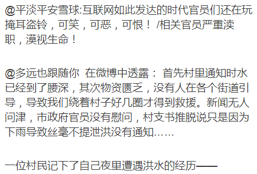
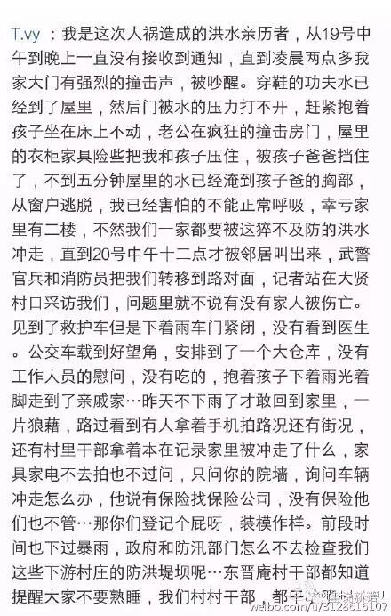

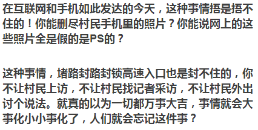

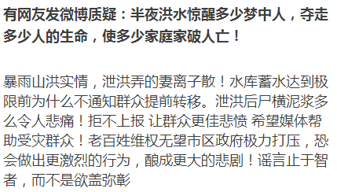

### 资料留存

高速公路围堵上访：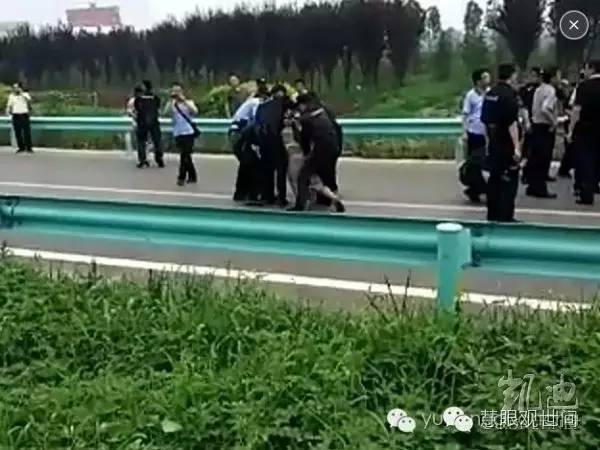

警方与村民对峙：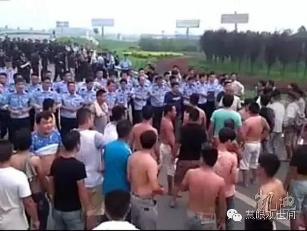

高速公路拦截村民上访：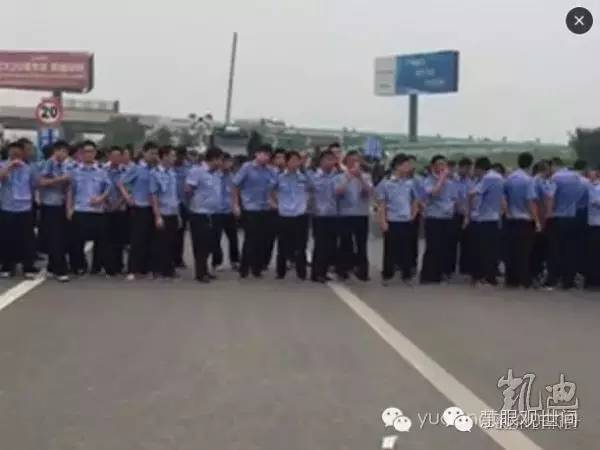

开发区管委会党工委副书记王清飞给村民下跪：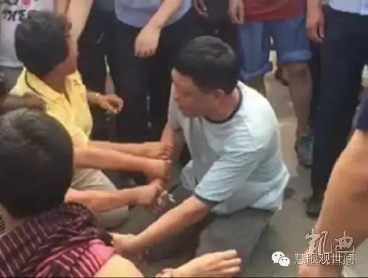

被淹死的小孩：

被淹死的村民：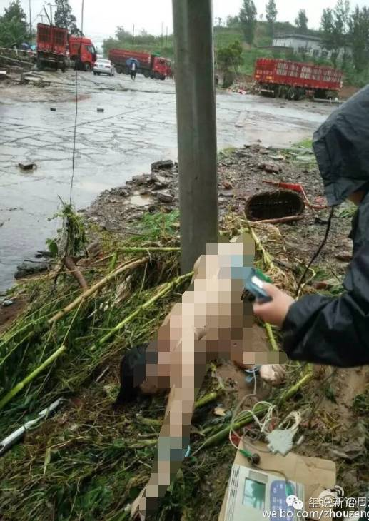
被淹死的村民：

死亡村民名单：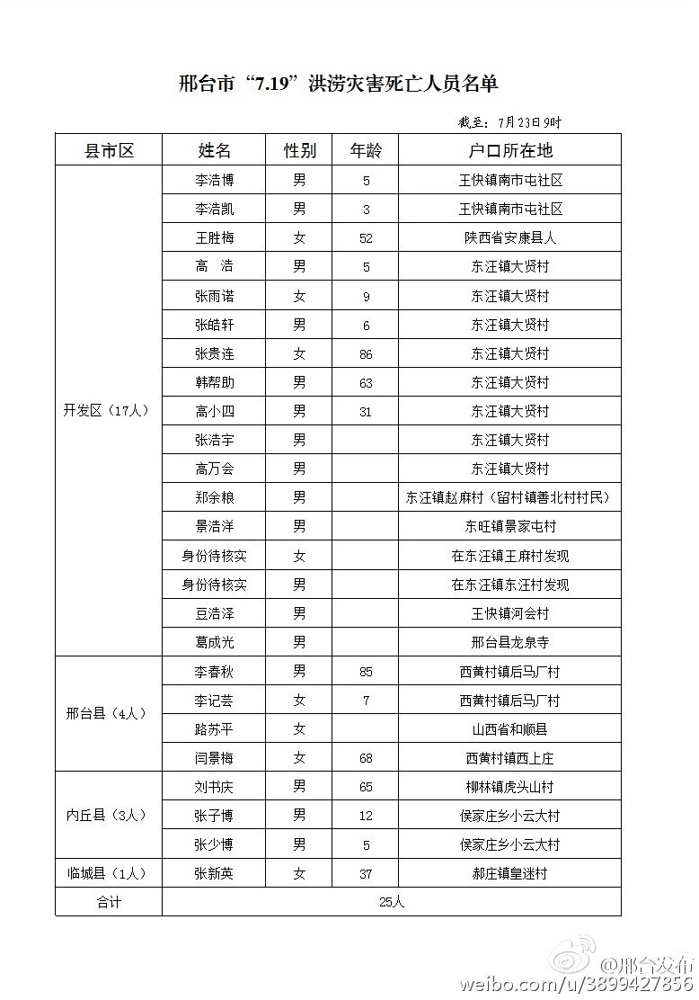

邢台市主政官员道歉：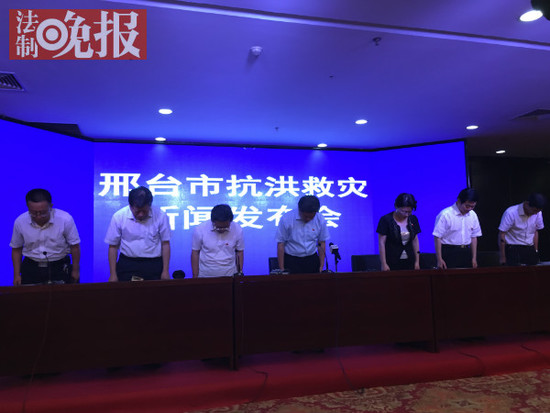

### 后续追踪

处理结果暂无。。。
