# 炎黄易主事件

### 关键词

非法抢占、停刊、不予受理

### 摘要

2016年7月13日，炎黄春秋的主管单位中国艺术研究院，给炎黄春秋杂志上发来《关于炎黄春秋杂志社领导班子职务聘任的通知》（中艺发[2016]22号）免去社长杜导正、副社长胡德华、总编徐庆全、副总编辑王彦君的职位；

并告之，该院与杂志社于2014年12月18日签订的《中国艺术研究院与炎黄春秋杂志社协议书》自动失效；与此同时派员强占办公室、财务室，甚至带行李住下，并窃取了《炎黄春秋》官方网站的后台账号及密码，从7月15日起陆续发布了“中国艺术研究院调整充实《炎黄春秋》杂志社领导班子”和“中国艺术研究院对炎黄春秋杂志社领导班子调整充实的依据”一系列文章；

### 事件进展

《炎黄春秋》杂志发布停刊声明：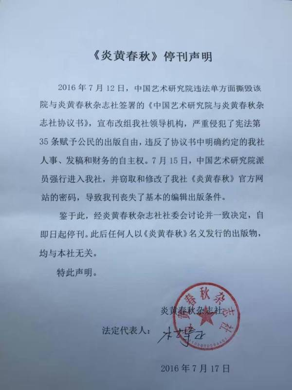

《炎黄春秋》起诉中国艺术研究院：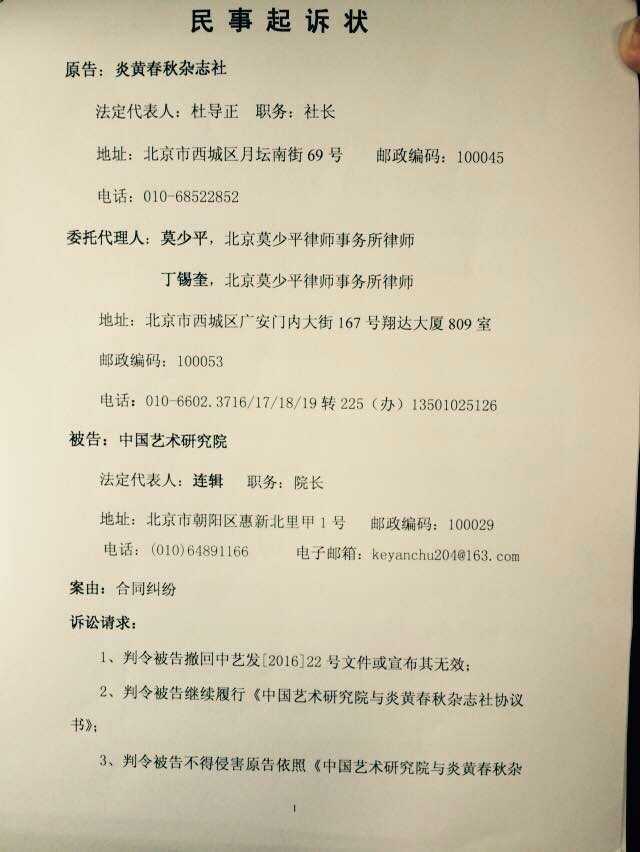
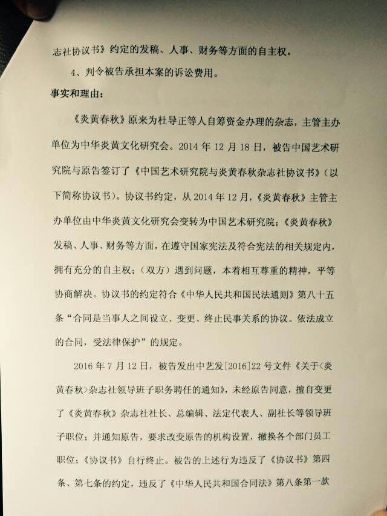
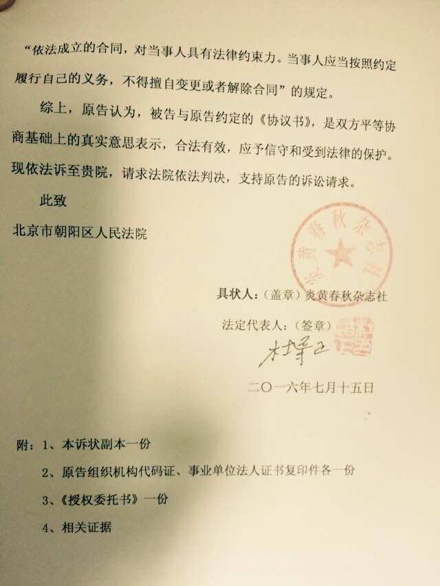

### 官方措施

2016年7月28日，北京市朝阳区人民法院做出不予受理《炎黄春秋》上诉案的裁定：

裁定书第一页：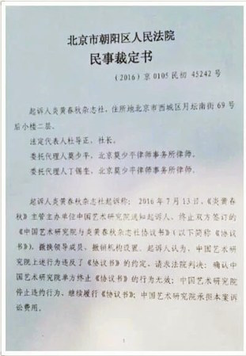

裁定书第二页：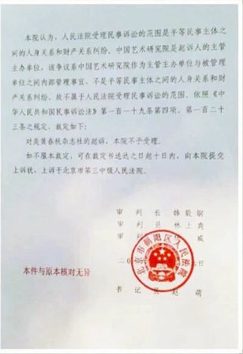

### 媒体报道

国内无。。。

### 关键人物

杜导正：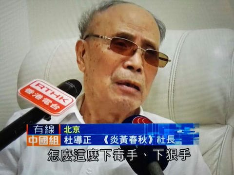
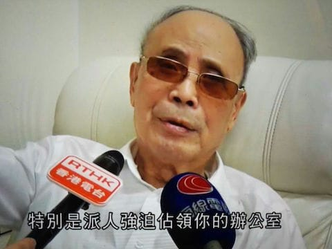

### 网友评论

学历的故事：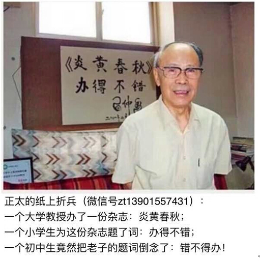

### 资料留存

中国艺术研究院关于《炎黄春秋》杂志社领导班子职务聘任的通知：
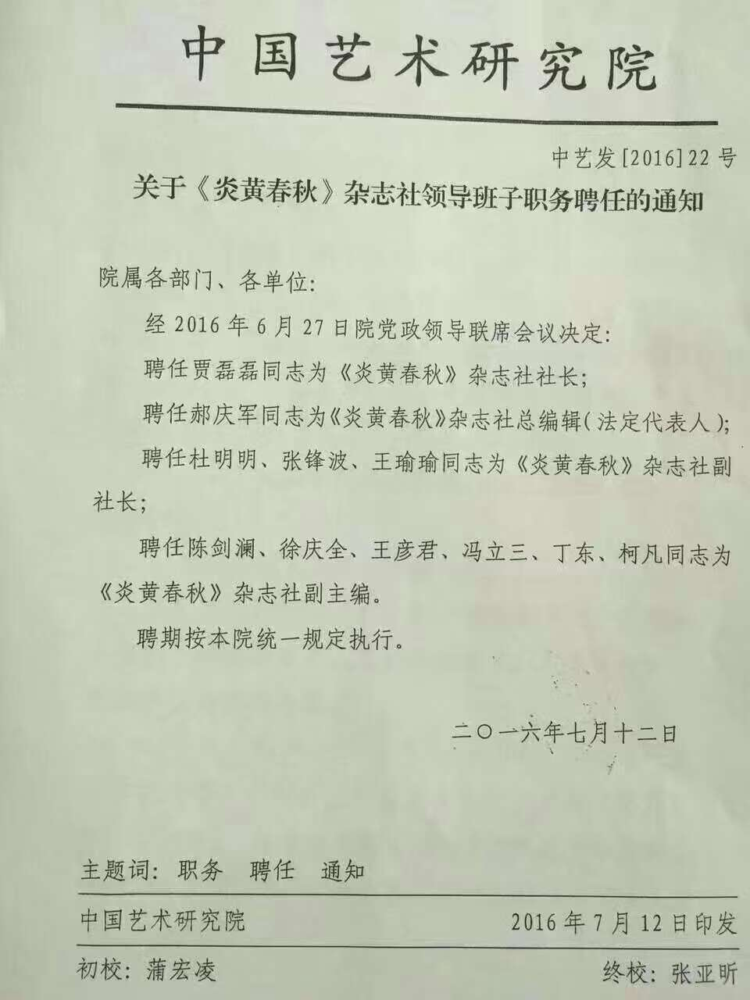

炎黄春秋网站发布的调整领导班子声明：
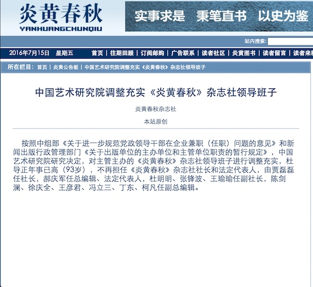

炎黄春秋网站发布的调整领导班子依据：
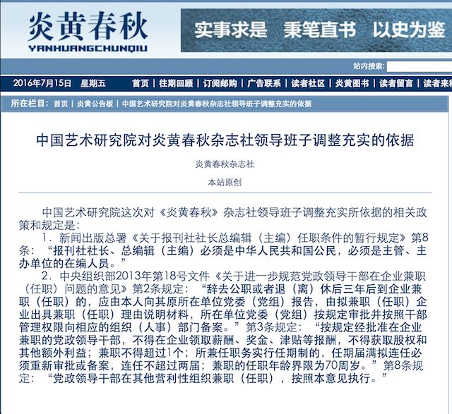

炎黄春秋百度搜索结果@2016/07/31: 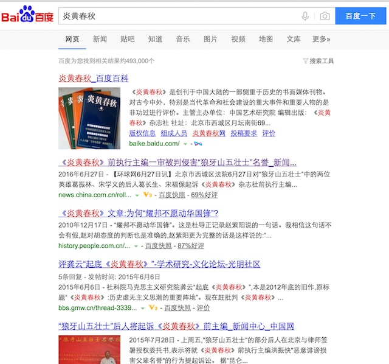

炎黄春秋谷歌搜索结果@2016/07/31: 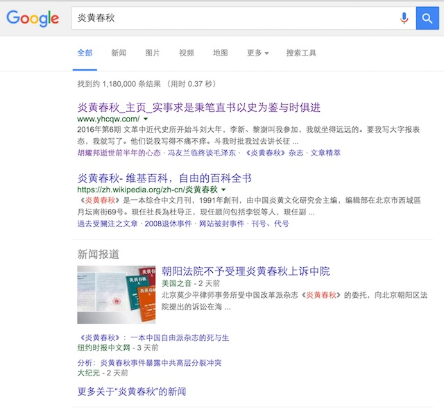

### 后续追踪

...
