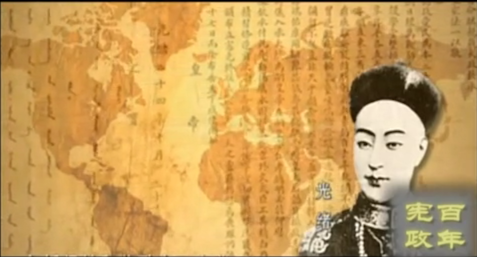
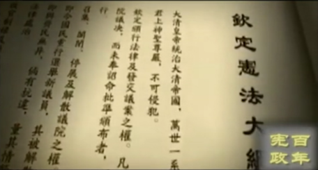
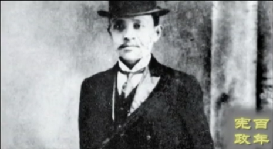
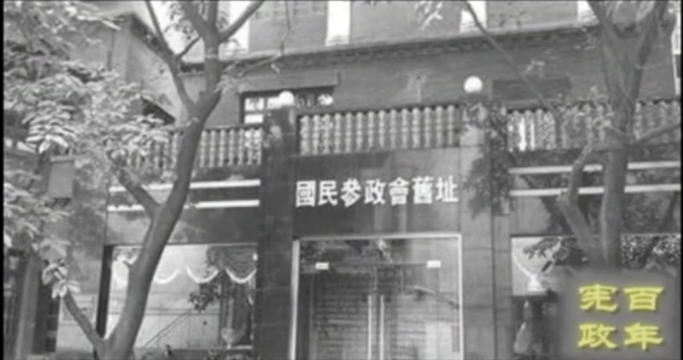
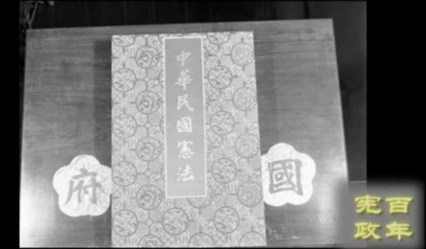
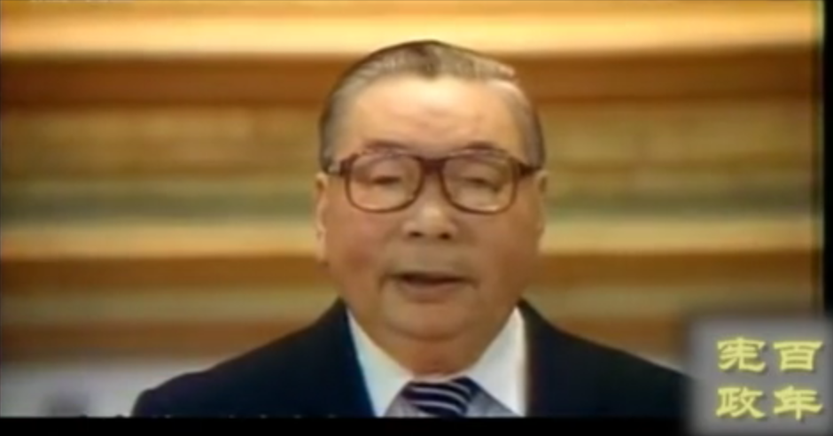

# 百年宪政-片花

> 为自己争取权利，就是为国家争取宪政！

鸦片战争挨打后，清廷痛定思痛，开始向西方学习，但也只局限于器物层面；

正如魏源所言：师夷之长技以制夷，故而有了洋务运动；

中日甲午一战，洋务运动军事成果毁于一旦；

一些知识分子精英认识到，清廷挨打的根源并不在器物层面，而是在于制度；

于是就有了后来的，以康有为和梁启超为首的公车上书，和光绪帝主导的戊戌变法；

戊戌变法是中国历史上第一次宪政方向的尝试，而后的百年历史，就是一个追求宪政的历程。。。

戊戌变法中的光绪帝： 

庚子事变之后，改良派与革命派赛跑， 为了防止革命，改良派发起了立宪运动；

日俄战争中，小国日本打败了大国俄国，让清廷震动：

> 日俄之胜负，立宪专制之胜负也，非小国能战胜与大国，实立宪能战胜于专制

为此，清廷宣布：预备立宪

戊戌变法中，宪政还只是一个模糊口号，而预备立宪则将宪政付诸实现，其中立宪派是中流砥柱；

但皇族内阁的成立，让立宪派大失所望；

改良即死，革命当立，辛亥革命就此爆发；

中国历史上第一部宪法《钦定宪法大纲》：

辛亥革命结束了上千年的君主专制，并开创了一个短暂的民主共和时代，这是其成功之处；

生逢其时的宋教仁也将他的宪政理念付诸实践，推行政党政治和内阁制；

清末的预备立宪是浅尝辄止的君主立宪，而民国初年的议会立阁则是一个初具规模的民主宪政；

可惜的是，宋教仁遇刺后，孙中山和袁世凯失去了和谈的基础，不惜兵戎相见，爆发二次革命；

民主宪政，命运多舛，可以说民初的民主宪政是实至名归的宪政；

宋教仁：

在南北对立中，南方各地方派联手倡导联省自治，而其中尤以陈炯明主导下的广东最为突出；

联省自治派主张仿效美国的联邦制，以地方自治为基础。

为此，陈炯明与主张党国体制的孙中山决裂。

随后，联省自治被孙中山和蒋介石联手发动的东征和北伐所摧毁。

抗日战争爆发后，成立了具有宪政会议性质的国民参政会，邹韬奋称其为晴天霹雳的宪政运动；

西安事变后，中共表示，愿意接受国民政府的领导，一致对外；

而国民参政会也成为其他政党参政议政的机构，为了中共及其他政党参政议政的机构；

为了促进宪政，各地都成立了宪政研究团体；

中共也成立了延安各界 宪政促进会，中共治下，也实行了带点民主性质的三三制原则；

国民参政会旧址：

抗战结束，国共两党签订双十协定，宣布结束训政，实施宪政；

并决定召开政治协商会议，以解决国会与 宪法问题；

在政协会议中，各方代表共同签署了和平建国纲领，保障人权、内阁制、议员直选、省县自治、司法独立、军队国家化等宪政原则；

以至于政协闭幕后，中共也决定要由武装斗争转变为议会斗争；

随后，国民政府颁布宪法，在内战中进行了总统选举；

民国宪法：

退守台湾后，作为威权政体的国民政府，与集权政府相比，给予民间相对大的空间，使得各种社会运动成为可能；

经过台湾民间社会的抗争，台湾政治在八十年代由威权向民主过渡；

台湾的民主宪政的成功转型，一是台湾民间社会的抗争，二是蒋经国的顺势而为，三是国际社会的奥援（这个对吗？）

蒋经国：

中共在大陆掌权后，初期与民主党派尚保留一点民主作风，随后的反右和文革，把过去残留的一点点民主和自由摧毁殆尽；

邓小平掌权后，搞改革开放，经济变革要求政治改革，胡耀邦和赵紫阳因支持自由化而下台；

进入新世纪，随着互联网的普及，国民的公民意识普遍觉醒；

宪政之争更是激发了民众对宪政的认可度，这似乎也预示着大陆也到了宪政转型的关键时刻；

...
